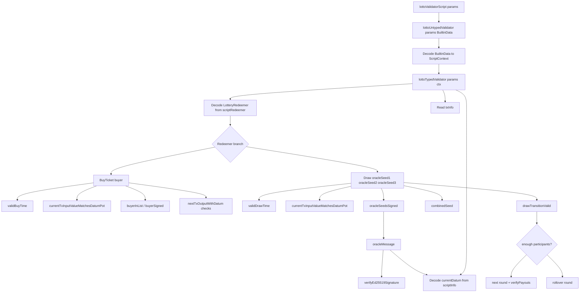

# Lotto Validator Architecture Overview v1

Date: 2026-07-17  
Code reference: `src/LottoValidator.hs`  
Related document: `docs/oracle-architecture-v1.md`

## Purpose

The lotto validator controls one stateful lottery UTxO. That UTxO carries the
current lottery datum and locks the current pot. Every valid transaction must
spend the current script UTxO and create exactly one next script UTxO so the
lottery state can continue.

There are two user-facing actions:

1. `BuyTicket`: a participant joins the current round before the round end time.
2. `Draw`: after the round end time, the lottery either pays winners and starts a
   new round, or rolls the round over when there are fewer than three
   participants.

> [!NOTE]
> **Plutus architecture note: V3 validator shape**
>
> The validator is written as a Plutus V3 spending validator. In V3, the
> validator receives one `BuiltinData` value for the whole script context. The
> datum and redeemer are extracted from `ScriptContext`, not passed as separate
> validator arguments.

## Document Scope

This document explains the whole lotto validator architecture: how the script
UTxO is spent, how the datum changes, which redeemer branch runs, and how the
next on-chain state is checked.

`docs/oracle-architecture-v1.md` is narrower. It explains only the randomness
subsystem used by the `Draw` branch: oracle seed messages, Ed25519 signatures,
seed combination, and replay resistance.

In short:

```text
lotto-validator-architecture-v1.md
  whole validator state machine
  BuyTicket path
  Draw path
  current/next UTxO checks
  backend transaction responsibilities

oracle-architecture-v1.md
  Draw randomness only
  oracle message bytes
  signature verification
  seed combination
  oracle-specific risks
```

## High-Level Contract Shape

The contract is a single-state-machine style validator:

```text
current script UTxO
  value: current pot Lovelace
  datum: LotteryDatum

transaction spends current script UTxO
  redeemer: BuyTicket buyer
        or Draw oracleSeed1 oracleSeed2 oracleSeed3

transaction creates exactly one continuing script output
  value: next pot Lovelace
  datum: next LotteryDatum
```

> [!NOTE]
> **Plutus architecture note: continuing output**
>
> Plutus calls the next output a "continuing output": it is an output locked by
> the same validator. In this lotto contract, the continuing output is how the
> next lottery state is stored on-chain.

The validator does not store hidden state. It only checks the datum, the value
locked at the current script UTxO, the transaction validity interval, signatures,
continuing output, and oracle seed signatures submitted in the redeemer.

## On-Chain Data Model

### `LotteryParams`

`LotteryParams` is fixed when the validator script is compiled/parameterized:

```haskell
data LotteryParams = LotteryParams
  { lpMaintainer :: PubKeyHash
  , lpTicketPrice :: Lovelace
  , lpOracle1PublicKey :: BuiltinByteString
  , lpOracle2PublicKey :: BuiltinByteString
  , lpOracle3PublicKey :: BuiltinByteString
  }
```

These fields are not stored in the datum and do not change round by round.

- `lpMaintainer` is the wallet intended to receive the maintenance fee once
  payout checking is implemented.
- `lpTicketPrice` is the exact Lovelace amount that must be added when a ticket
  is bought.
- `lpOracle1PublicKey`, `lpOracle2PublicKey`, and `lpOracle3PublicKey` are raw
  Ed25519 public keys used to verify draw randomness.

The practical reason to keep these as parameters is that they define the rules of
this particular validator instance. If the ticket price or oracle keys change,
that should normally be a different script instance, not a casual state update
inside a round datum.

### `LotteryDatum`

`LotteryDatum` is the state stored at the script UTxO:

```haskell
data LotteryDatum = LotteryDatum
  { ldRoundEndTime :: POSIXTime
  , ldParticipants :: [PubKeyHash]
  , ldPot :: Lovelace
  }
```

The datum is the contract's local copy of the lottery state:

- `ldRoundEndTime` defines when buying stops and drawing may start.
- `ldParticipants` records the wallets that bought tickets for the current
  round.
- `ldPot` records how much Lovelace the script believes is locked in the lottery
  pot.

> [!NOTE]
> **Plutus architecture note: datum versus value**
>
> The validator also checks the real Lovelace value of the current script UTxO.
> This matters because a datum is just data. The transaction cannot be allowed to
> claim `ldPot = 100 ADA` while the actual spent script UTxO contains less.

### `OracleSeed`

`OracleSeed` is used only by the `Draw` redeemer:

```haskell
data OracleSeed = OracleSeed
  { osSeed :: BuiltinByteString
  , osSignature :: BuiltinByteString
  }
```

Each oracle contributes random seed bytes plus a signature. The validator does
not trust seed bytes merely because they appear in the redeemer. It accepts them
only after verifying that the configured oracle public key signed the expected
lottery message for the current state.

The byte-level oracle design is documented in `docs/oracle-architecture-v1.md`.

### `LotteryRedeemer`

`LotteryRedeemer` chooses which transition the transaction is attempting:

```haskell
data LotteryRedeemer
  = BuyTicket PubKeyHash
  | Draw OracleSeed OracleSeed OracleSeed
```

`BuyTicket buyer` means "add this buyer to the current round." `Draw` means
"close this round using these three oracle seeds."

## Validator Entry Point

> [!NOTE]
> **Plutus architecture note: boundary decoding**
>
> This section describes the boundary between raw Plutus data and typed validator
> logic. The chain gives the script `BuiltinData`; this code decodes that into a
> `ScriptContext`, then extracts typed values before running the business rules.

The compiled validator entry point is:

```haskell
lottoUntypedValidator ::
  LotteryParams ->
  BuiltinData ->
  BuiltinUnit
```

It decodes the incoming `BuiltinData` as a `ScriptContext`:

```haskell
PlutusTx.unsafeFromBuiltinData ctx
```

Then `lottoTypedValidator` extracts:

- the redeemer from `scriptRedeemer`;
- the current datum from `scriptInfo`;
- transaction fields from `txInfo`.

The code intentionally decodes at the boundary and then runs typed logic. That
keeps the validator easier to read: most helper functions operate on
`LotteryDatum`, `LotteryRedeemer`, `TxOut`, `Lovelace`, and `PubKeyHash` instead
of raw `BuiltinData`.

### Validator Dependency Tree

Markdown can show this as a plain-text tree, which is the most portable option:

```text
lottoValidatorScript params
`-- compiles and applies params to lottoUntypedValidator
    `-- lottoUntypedValidator params ctxBuiltinData
        |-- decodes ctxBuiltinData
        |   `-- ScriptContext
        `-- lottoTypedValidator params ctx
            |-- scriptRedeemer
            |   `-- getRedeemer
            |       `-- LotteryRedeemer
            |           |-- BuyTicket buyer
            |           |   |-- validBuyTime
            |           |   |   `-- txInfoValidRange
            |           |   |-- currentTxInputValueMatchesDatumPot
            |           |   |   |-- findOwnInput
            |           |   |   |-- txInInfoResolved
            |           |   |   |-- txOutValue
            |           |   |   `-- ldPot currentDatum
            |           |   |-- buyerInList
            |           |   |   `-- ldParticipants currentDatum
            |           |   |-- buyerSigned
            |           |   |   `-- txInfoSignatories
            |           |   |-- nextDatumPotIncreasesByTicketPrice
            |           |   |   `-- nextTxOutputWithDatum
            |           |   |-- nextTxOutputHasExpectedPot
            |           |   |   `-- nextTxOutputWithDatum
            |           |   `-- nextDatumAddsBuyer
            |           |       `-- nextTxOutputWithDatum
            |           `-- Draw oracleSeed1 oracleSeed2 oracleSeed3
            |               |-- validDrawTime
            |               |   `-- txInfoValidRange
            |               |-- currentTxInputValueMatchesDatumPot
            |               |-- oracleSeedsSigned
            |               |   |-- oracleSeedSigned oracle1PublicKey oracleSeed1
            |               |   |-- oracleSeedSigned oracle2PublicKey oracleSeed2
            |               |   `-- oracleSeedSigned oracle3PublicKey oracleSeed3
            |               |       |-- oracleMessage
            |               |       |   |-- ldRoundEndTime currentDatum
            |               |       |   |-- ldPot currentDatum
            |               |       |   `-- osSeed
            |               |       `-- verifyEd25519Signature
            |               |-- combinedSeed
            |               |   `-- blake2b_256 seed bytes
            |               `-- drawTransitionValid
            |                   |-- enoughParticipants
            |                   |   `-- ldParticipants currentDatum
            |                   |-- nextTxOutputStartsNewRound
            |                   |   `-- nextTxOutputWithDatum
            |                   |-- nextTxOutputRollsOverRound
            |                   |   `-- nextTxOutputWithDatum
            |                   `-- verifyPayouts
            |                       `-- selectWinners
            |                           |-- winnerIndex
            |                           |-- selectAt
            |                           `-- removeWinner
            |-- scriptInfo
            |   `-- currentDatum
            `-- txInfo
                |-- inputs / own input
                |-- outputs / continuing output
                |-- valid range
                `-- signatories
```

The same structure as a Mermaid diagram, for renderers that support Mermaid:



## Shared Validation Checks

Both `BuyTicket` and `Draw` depend on the current script UTxO being honest.

### Current Input Lookup

The validator uses:

```haskell
findOwnInput ctx
```

> [!NOTE]
> **Plutus architecture note: own input**
>
> `findOwnInput` is a Plutus helper that finds the transaction input currently
> spending this validator.

The code then uses:

```haskell
txInInfoResolved txInput
```

`txInInfoResolved` returns the `TxOut` being spent by that input. From there, the
validator reads the actual locked value:

```haskell
lovelaceValueOf (txOutValue currentTxInputResolvedTxOutput)
```

### Current Pot Integrity

The shared check is:

```haskell
currentTxInputValueMatchesDatumPot =
  currentTxInputValue == ldPot currentDatum
```

This check protects every later rule that trusts `ldPot currentDatum`. Without
it, a transaction could carry a misleading datum and make payout or rollover
logic reason about the wrong amount.

### Continuing Output Lookup

> [!NOTE]
> **Plutus architecture note: next script state**
>
> State transitions use `getContinuingOutputs ctx` to find the next output
> locked by the same validator. That output carries the next lotto datum.

State transitions use:

```haskell
getContinuingOutputs ctx
```

The validator expects exactly one continuing output and an inline
`LotteryDatum`:

```haskell
nextTxOutputWithDatum =
  case getContinuingOutputs ctx of
    [txOutput] -> decode inline output datum
    _ -> traceError "Expected exactly one continuing output"
```

This creates a simple state-machine rule: each accepted transaction consumes one
lotto state and creates one next lotto state.

## Buy Ticket Transition

The `BuyTicket` branch checks:

```haskell
BuyTicket buyer ->
  [ validBuyTime
  , currentTxInputValueMatchesDatumPot
  , not (buyerInList buyer)
  , buyerSigned buyer
  , nextDatumPotIncreasesByTicketPrice
  , nextTxOutputHasExpectedPot
  , nextDatumAddsBuyer buyer
  ]
```

### Time Rule

Tickets can be bought only before `ldRoundEndTime`:

```haskell
validBuyTime =
  to currentRoundEndTime with strict upper bound
    `contains` txInfoValidRange txInfo
```

The transaction validity range must fit before the round end. This avoids a
transaction being valid both before and after the draw boundary.

### Duplicate Ticket Rule

The validator rejects a buyer already in `ldParticipants`:

```haskell
not (buyerInList buyer)
```

In the current design, one `PubKeyHash` can buy at most one ticket per round.
The participant list is therefore both the ticket list and the uniqueness check.

### Buyer Authorization Rule

The buyer must sign the transaction:

```haskell
buyerSigned buyer
```

`txInfoSignatories` is the list of public key hashes that signed the transaction.
The validator checks that `buyer` is present. Without this, someone else could
add a wallet to the participant list without that wallet's approval.

### Pot Increase Rule

The next datum must increase `ldPot` by exactly `lpTicketPrice`:

```haskell
ldPot nextDatum - ldPot currentDatum == lpTicketPrice params
```

This checks the state value recorded in the datum.

### Locked Value Rule

The actual continuing output must also lock the expected Lovelace:

```haskell
lovelaceValueOf (txOutValue nextTxOutput) ==
  currentTxInputValue + lpTicketPrice params
```

This checks the real value on the output. The datum rule and value rule work
together: the datum must say the pot increased, and the output must actually
contain that increased pot.

### Participant Update Rule

The next datum must preserve the round end time and prepend the buyer:

```haskell
ldRoundEndTime nextDatum == currentRoundEndTime
ldParticipants nextDatum == buyer : ldParticipants currentDatum
```

The code uses prepending because it is cheap for linked lists. The tradeoff is
that participant order is reverse purchase order. Since winner selection uses
list indexes, the backend and tests must treat this order as part of the on-chain
rule.

## Draw Transition

The `Draw` branch checks:

```haskell
Draw oracleSeed1 oracleSeed2 oracleSeed3 ->
  [ validDrawTime
  , currentTxInputValueMatchesDatumPot
  , oracleSeedsSigned oracleSeed1 oracleSeed2 oracleSeed3
  , drawTransitionValid (combinedSeed oracleSeed1 oracleSeed2 oracleSeed3)
  ]
```

### Time Rule

Draw transactions can happen only at or after `ldRoundEndTime`:

```haskell
validDrawTime =
  from currentRoundEndTime `contains` txInfoValidRange txInfo
```

This keeps buys and draws separated by time. A draw transaction must not be valid
before the round has ended.

### Oracle Authorization Rule

The draw redeemer must carry three oracle seeds, each signed by its configured
oracle key:

```haskell
oracleSeedsSigned oracleSeed1 oracleSeed2 oracleSeed3
```

The validator verifies signatures with `verifyEd25519Signature`. The signed
message includes the lottery version label, current round end time, current pot,
and the submitted seed. This prevents the transaction builder from using
unsigned seeds or replaying old signatures for a different state.

### Combined Draw Seed

The three oracle seeds are combined in fixed order:

```haskell
combinedSeed =
  blake2b_256 (seed1 <> seed2 <> seed3)
```

The fixed order is part of the rule. Swapping seeds changes the combined seed and
therefore may change winners.

### Enough Participants Path

When there are at least three participants:

```haskell
drawTransitionValid seed =
  nextTxOutputStartsNewRound && verifyPayouts seed
```

`nextTxOutputStartsNewRound` checks that the continuing output:

- advances `ldRoundEndTime` by one day;
- resets `ldParticipants` to `[]`;
- sets `ldPot` to the Lovelace actually locked at the next script output.

This starts the next round after the draw.

`verifyPayouts` is currently incomplete. It selects three winners but does not
yet verify that transaction outputs pay those winners and the maintainer. This is
the main production gap in the current validator.

### Rollover Path

When there are fewer than three participants:

```haskell
drawTransitionValid seed =
  nextTxOutputRollsOverRound
```

The rollover continuing output must:

- advance `ldRoundEndTime` by one day;
- keep the same participants;
- keep the same pot;
- lock exactly that pot in the next script output.

No payouts are checked in this path. The funds and participants remain in the
contract for the next round.

## Winner Selection

Winner selection is deterministic. The validator cannot call a random API, so
randomness must already be represented by the verified oracle seeds.

The validator derives three hashes:

```haskell
seed1 = blake2b_256 (combinedSeed <> "1")
seed2 = blake2b_256 (combinedSeed <> "2")
seed3 = blake2b_256 (combinedSeed <> "3")
```

For each derived hash, it reads the first four bytes, converts them into an
integer, and reduces that integer modulo the participant count:

```haskell
winnerIndex = entropy `modulo` participantCount
```

After selecting winner 1, the validator removes that winner from the list before
selecting winner 2. It does the same before selecting winner 3. This prevents one
participant from taking multiple prize positions in the same draw.

## Current Payout Gap

The payout section is not production-ready:

```haskell
calculateFees = (pot, pot, pot, pot)
verifyPayouts seed = case selectWinners seed of
  [_winner1, _winner2, _winner3] -> True
```

The current `verifyPayouts` proves only that three winners can be selected. It
does not check:

- how the pot is split;
- whether winner outputs exist;
- whether the maintainer receives the intended fee;
- whether extra Lovelace remains locked or is stolen;
- whether payout addresses correspond to the selected `PubKeyHash` values.

Before mainnet use, `verifyPayouts` should inspect `txInfoOutputs` and enforce
the full payout rule.

## Backend Responsibilities

The off-chain backend must build transactions that match these on-chain rules.

For `BuyTicket`, the backend must:

1. Find the current lottery script UTxO.
2. Read and decode `LotteryDatum`.
3. Ensure the buyer is not already in `ldParticipants`.
4. Add the buyer signature to the transaction.
5. Create exactly one continuing output with:
   - same `ldRoundEndTime`;
   - `buyer : current participants`;
   - `ldPot + lpTicketPrice`;
   - actual Lovelace value equal to current script value plus ticket price.
6. Set a validity interval strictly before `ldRoundEndTime`.

For `Draw`, the backend must:

1. Find the current lottery script UTxO.
2. Read and decode `LotteryDatum`.
3. Wait until the transaction validity range can start at or after
   `ldRoundEndTime`.
4. Ask the three oracles for seeds and signatures for this exact current state.
5. Build `Draw oracleSeed1 oracleSeed2 oracleSeed3` in the configured oracle
   order.
6. If there are fewer than three participants, create the rollover continuing
   output.
7. If there are at least three participants, create the next-round continuing
   output and, after payout logic is implemented, winner and maintainer outputs.

## Security and Design Notes

- The datum participant list is attacker-visible and grows with each ticket. A
  large list can increase script cost. A production design may need a maximum
  participant count, batched rounds, proof tokens, or another bounded structure.
- The current lottery has a single shared state UTxO. This is simple, but it
  creates contention: only one successful transaction can consume the current
  state at a time.
- The oracle design verifies authorization, but it is not a full commit-reveal
  protocol. A transaction builder that sees all seeds before submission may
  withhold an unfavorable draw transaction.
- The current one-ticket-per-`PubKeyHash` rule is easy to audit, but it means
  users cannot intentionally buy multiple tickets from the same wallet.
- `verifyPayouts` must be completed before the draw path is economically safe.

## v2 Candidates

Likely next improvements:

- implement real payout verification against `txInfoOutputs`;
- define the exact prize split and maintainer fee;
- add tests for unauthorized buyers and duplicate tickets;
- add tests for buy/draw time-boundary behavior;
- add tests for rollover with zero, one, and two participants;
- add oracle signature negative tests from `docs/oracle-architecture-v1.md`;
- bound participant list size or redesign ticket representation;
- generate a lotto validator blueprint, not only the auction blueprint;
- profile script size and execution budget before optimizing helper structure.
