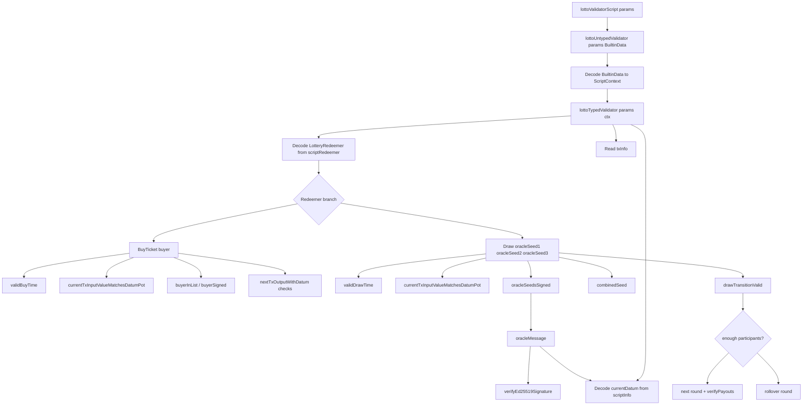

# Lotto Plutus Architecture Overview v1

Date: 2026-07-17  
Code reference: `src/LottoValidator.hs`  
Related documents:

- `docs/lotto-business-architecture-v1.md`
- `docs/oracle-architecture-v1.md`

## Purpose

This document explains how the lotto validator is wired as Plutus/Plinth code.
It focuses on validator entry, data decoding, transaction context lookup,
current/next UTxO handling, and helper dependencies.

For the higher-level product and protocol rules, see
`docs/lotto-business-architecture-v1.md`.

## Validator Shape

> [!NOTE]
> **Plutus architecture note: V3 validator shape**
>
> The validator is written as a Plutus V3 spending validator. In V3, the
> validator receives one `BuiltinData` value for the whole script context. The
> datum and redeemer are extracted from `ScriptContext`, not passed as separate
> validator arguments.

The compiled validator entry point is:

```haskell
lottoUntypedValidator ::
  LotteryParams ->
  BuiltinData ->
  BuiltinUnit
```

`LotteryParams` is applied when the script is compiled/parameterized. The
runtime input is the raw `BuiltinData` script context.

## Boundary Decoding

> [!NOTE]
> **Plutus architecture note: boundary decoding**
>
> The chain gives the script `BuiltinData`; this code decodes that into a
> `ScriptContext`, then extracts typed values before running the business rules.

The untyped validator decodes the incoming `BuiltinData` as a `ScriptContext`:

```haskell
PlutusTx.unsafeFromBuiltinData ctx
```

Then `lottoTypedValidator` extracts:

- the redeemer from `scriptRedeemer`;
- the current datum from `scriptInfo`;
- transaction fields from `txInfo`.

The code intentionally decodes at the boundary and then runs typed logic. That
keeps most helper functions operating on `LotteryDatum`, `LotteryRedeemer`,
`TxOut`, `Lovelace`, and `PubKeyHash` instead of raw `BuiltinData`.

The tradeoff is that malformed input causes whole-script failure. That is
appropriate here because a transaction with an undecodable context, redeemer, or
datum is invalid for this validator.

## Dependency Tree

Markdown can show this as a plain-text tree, which is the most portable option:

```text
lottoValidatorScript params
`-- compiles and applies params to lottoUntypedValidator
    `-- lottoUntypedValidator params ctxBuiltinData
        |-- decodes ctxBuiltinData
        |   `-- ScriptContext
        `-- lottoTypedValidator params ctx
            |-- scriptRedeemer
            |   `-- getRedeemer
            |       `-- LotteryRedeemer
            |           |-- BuyTicket buyer
            |           |   |-- validBuyTime
            |           |   |   `-- txInfoValidRange
            |           |   |-- currentTxInputValueMatchesDatumPot
            |           |   |   |-- findOwnInput
            |           |   |   |-- txInInfoResolved
            |           |   |   |-- txOutValue
            |           |   |   `-- ldPot currentDatum
            |           |   |-- buyerInList
            |           |   |   `-- ldParticipants currentDatum
            |           |   |-- buyerSigned
            |           |   |   `-- txInfoSignatories
            |           |   |-- nextDatumPotIncreasesByTicketPrice
            |           |   |   `-- nextTxOutputWithDatum
            |           |   |-- nextTxOutputHasExpectedPot
            |           |   |   `-- nextTxOutputWithDatum
            |           |   `-- nextDatumAddsBuyer
            |           |       `-- nextTxOutputWithDatum
            |           `-- Draw oracleSeed1 oracleSeed2 oracleSeed3
            |               |-- validDrawTime
            |               |   `-- txInfoValidRange
            |               |-- currentTxInputValueMatchesDatumPot
            |               |-- oracleSeedsSigned
            |               |   |-- oracleSeedSigned oracle1PublicKey oracleSeed1
            |               |   |-- oracleSeedSigned oracle2PublicKey oracleSeed2
            |               |   `-- oracleSeedSigned oracle3PublicKey oracleSeed3
            |               |       |-- oracleMessage
            |               |       |   |-- ldRoundEndTime currentDatum
            |               |       |   |-- ldPot currentDatum
            |               |       |   `-- osSeed
            |               |       `-- verifyEd25519Signature
            |               |-- combinedSeed
            |               |   `-- blake2b_256 seed bytes
            |               `-- drawTransitionValid
            |                   |-- enoughParticipants
            |                   |   `-- ldParticipants currentDatum
            |                   |-- nextTxOutputStartsNewRound
            |                   |   `-- nextTxOutputWithDatum
            |                   |-- nextTxOutputRollsOverRound
            |                   |   `-- nextTxOutputWithDatum
            |                   `-- verifyPayouts
            |                       `-- selectWinners
            |                           |-- winnerIndex
            |                           |-- selectAt
            |                           `-- removeWinner
            |-- scriptInfo
            |   `-- currentDatum
            `-- txInfo
                |-- inputs / own input
                |-- outputs / continuing output
                |-- valid range
                `-- signatories
```

The same structure as a Mermaid diagram, for renderers that support Mermaid:



## Current Datum Extraction

The current datum is extracted from `scriptInfo`:

```haskell
currentDatum = case scriptInfo of
  SpendingScript _ (Just (Datum datum)) ->
    case PlutusTx.fromBuiltinData datum of
      Just d -> d
      Nothing -> traceError "Failed to parse LotteryDatum"
  _ -> traceError "Expected SpendingScript with datum"
```

`SpendingScript` means this validator is being used to spend a script UTxO. The
datum may be absent in the V3 context, so this validator explicitly rejects the
absent-datum case.

## Redeemer Extraction

The redeemer is extracted from `scriptRedeemer`:

```haskell
redeemer = case PlutusTx.fromBuiltinData (getRedeemer scriptRedeemer) of
  Nothing -> PlutusTx.traceError "Failed to parse LotteryRedeemer"
  Just r -> r
```

`getRedeemer` unwraps the `Redeemer` newtype from the script context. The
validator then decodes it into `LotteryRedeemer`, which chooses either the
`BuyTicket` branch or the `Draw` branch.

## Current Input Lookup

> [!NOTE]
> **Plutus architecture note: own input**
>
> `findOwnInput` is a Plutus helper that finds the transaction input currently
> spending this validator.

The validator resolves that input to the actual output being spent:

```haskell
currentTxInputResolvedTxOutput = case findOwnInput ctx of
  Just txInput -> txInInfoResolved txInput
  Nothing -> traceError "Expected own input"
```

`txInInfoResolved` returns the `TxOut` being spent by that input. From there, the
validator reads the actual locked Lovelace:

```haskell
currentTxInputValue =
  lovelaceValueOf (txOutValue currentTxInputResolvedTxOutput)
```

This value is compared with `ldPot currentDatum` before later logic trusts the
datum's pot field.

## Continuing Output Lookup

> [!NOTE]
> **Plutus architecture note: next script state**
>
> State transitions use `getContinuingOutputs ctx` to find the next output
> locked by the same validator. That output carries the next lotto datum.

The validator expects exactly one continuing output with an inline
`LotteryDatum`:

```haskell
nextTxOutputWithDatum = case getContinuingOutputs ctx of
  [txOutput] -> case txOutDatum txOutput of
    OutputDatum (Datum nextDatumData) ->
      case PlutusTx.fromBuiltinData nextDatumData of
        Just nextDatum -> (txOutput, nextDatum)
        Nothing -> traceError "Failed to parse output LotteryDatum"
    _ -> traceError "Expected inline output datum"
  _ -> traceError "Expected exactly one continuing output"
```

This gives the validator a simple state transition shape:

```text
currentDatum/currentTxInputValue
  -> transaction checks
  -> nextDatum/nextTxOutputValue
```

## Datum Versus Value

> [!NOTE]
> **Plutus architecture note: datum versus value**
>
> A datum is data attached to a UTxO. It can say the pot is some amount, but the
> validator must also inspect the actual `txOutValue` to know how much Lovelace
> is really locked.

The shared integrity check is:

```haskell
currentTxInputValueMatchesDatumPot =
  currentTxInputValue == ldPot currentDatum
```

The buy-ticket path also checks both the next datum and the next output value:

```haskell
ldPot nextDatum - ldPot currentDatum == lpTicketPrice params
lovelaceValueOf (txOutValue nextTxOutput) ==
  currentTxInputValue + lpTicketPrice params
```

The first line checks the state written into the next datum. The second line
checks the real Lovelace locked at the next script output.

## Branch Dependencies

The top-level validator builds a branch-specific list of conditions:

```haskell
conditions = case redeemer of
  BuyTicket buyer -> [...]
  Draw oracleSeed1 oracleSeed2 oracleSeed3 -> [...]
```

The current code consumes that list with `List.and`. This is readable and useful
for learning, but cost-sensitive production versions may want a more direct
`PlutusTx.&&` structure around expensive or branch-specific checks.

Several helpers use lazy pattern bindings, such as `~validBuyTime` and
`~validDrawTime`. This matters because the project enables strict local
bindings. The lazy pattern avoids evaluating branch-specific helpers before the
branch actually needs them.

## BuyTicket Helper Flow

```text
BuyTicket buyer
|-- validBuyTime
|   `-- txInfoValidRange is strictly before currentRoundEndTime
|-- currentTxInputValueMatchesDatumPot
|-- not (buyerInList buyer)
|   `-- scan ldParticipants currentDatum
|-- buyerSigned buyer
|   `-- scan txInfoSignatories
|-- nextDatumPotIncreasesByTicketPrice
|   `-- decode nextTxOutputWithDatum
|-- nextTxOutputHasExpectedPot
|   `-- compare next txOutValue with current value + ticket price
`-- nextDatumAddsBuyer
    `-- same round end, buyer prepended to current participants
```

## Draw Helper Flow

```text
Draw oracleSeed1 oracleSeed2 oracleSeed3
|-- validDrawTime
|   `-- txInfoValidRange starts at or after currentRoundEndTime
|-- currentTxInputValueMatchesDatumPot
|-- oracleSeedsSigned
|   |-- oracleMessage current datum + oracleSeed1
|   |-- verifyEd25519Signature oracle1 key
|   |-- oracleMessage current datum + oracleSeed2
|   |-- verifyEd25519Signature oracle2 key
|   |-- oracleMessage current datum + oracleSeed3
|   `-- verifyEd25519Signature oracle3 key
`-- drawTransitionValid combinedSeed
    |-- enough participants
    |   `-- nextTxOutputStartsNewRound && verifyPayouts
    `-- fewer than three participants
        `-- nextTxOutputRollsOverRound
```

## Plutus-Specific Follow-Ups

- Consider replacing condition lists with explicit short-circuiting
  `PlutusTx.&&` where budget measurements justify it.
- Keep `INLINEABLE` on on-chain helpers so the Plinth compiler can see their
  bodies.
- Preserve the Cabal/GHC options that keep Plinth output predictable unless
  there is a measured reason to change them.
- Build the relevant Cabal target and regenerate/check blueprints after
  validator interface changes.
